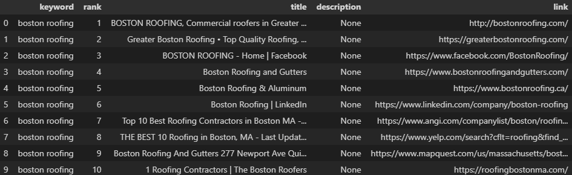

# Google-Search-Scraping

2020 Project to find backend-links

## Example

- scrape_google("boston roofing",11)

## Setup

### Environment

- py -m venv env
- env\Scripts\activate.bat

### Dependencies

- pip install -r requirements.txt
